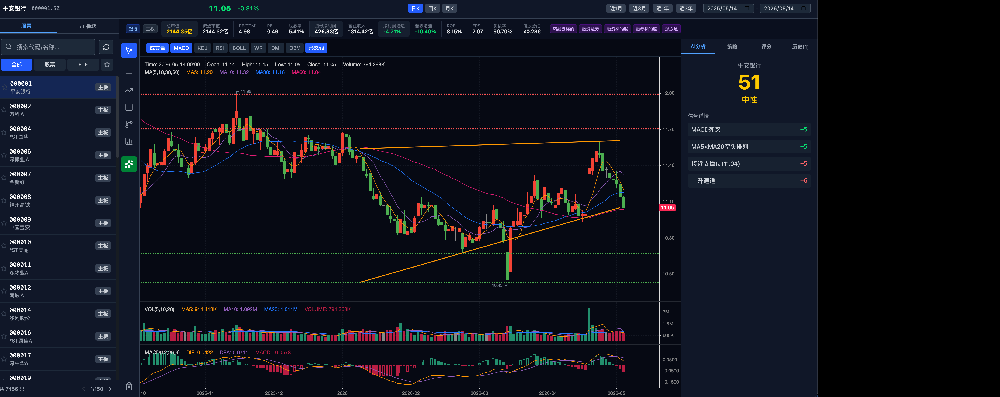

# TK Trade — A股交易分析系统

A 股分析平台，提供 K 线图、技术指标、形态识别、板块分析、智能选股与 综合评分。

---

## 功能概览

### 股票分析
- **K 线图**：日/周/月线蜡烛图，前复权数据（Tushare Pro）
- **技术指标**：MA · MACD · KDJ · RSI · BOLL · WR · DMI · OBV
- **手动画线**：水平线、趋势线、矩形、平行通道、斐波那契回撤
- **自动形态识别**：支撑/压力位、上升/下降通道、震荡箱体、头肩顶/底
- **基本面信息栏**：总市值、PE/PB、ROE、净利润/营收增速、股息率、概念标签

### 板块指数
- **主要指数**：上证综指、沪深 300、深证成指、创业板指、中证 500、上证 50
- **申万一级行业**：36 个动态加载的活跃板块（自动过滤已退市指数）
- **板块 K 线**：与股票完全一致的图表功能，支持全部画线和指标工具
- **强势板块排名**：AI 评分综合排名，展示今日涨跌、5 日涨跌

### AI 分析（股票 & 板块通用）
- MACD 金/死叉 · 均线多/空头排列 · RSI 超买/超卖
- 布林带突破 · 放量上涨/下跌 · 支撑位接近 · 趋势通道 · 头肩底/顶
- 0–100 综合评分 + 信号权重明细 + 看多/看空建议

### 智能选股
- **策略选股**：10 种技术形态策略批量筛选（可按行业、排除 ST）
- **综合评分选股**：技术面（60%）+ 基本面（40%）异步后台扫描，支持进度实时轮询
- **历史记录**：最近 10 次选股记录本地保存，支持一键恢复结果

### 自选股
- 一键星标收藏任意股票，自选模式过滤只看收藏，LocalStorage 持久化

---

## 快速启动

### 1. 配置 Tushare Token

```bash
cp backend/.env.example backend/.env
```

编辑 `backend/.env`：

```
TUSHARE_TOKEN=你的Token
DATABASE_URL=sqlite+aiosqlite:///./data/trade.db
```

> 在 [tushare.pro](https://tushare.pro) 注册免费获取 Token。

---

### 2. 启动后端

```bash
cd backend

# 首次：创建虚拟环境并安装依赖
python3 -m venv .venv
.venv/bin/pip install -r requirements.txt

# 启动（开发模式，支持热重载）
.venv/bin/uvicorn app.main:app --reload --port 8000
```

验证：
```bash
curl http://localhost:8000/api/health
# {"status":"ok","message":"TK-Trade API is running"}
```

---

### 3. 启动前端

```bash
cd frontend
npm install
npm run dev
```

打开浏览器：**http://localhost:5173**

---

### 4. 同步股票数据（首次必做）

前后端启动后，点击左侧股票列表右上角的 **刷新图标**，从 Tushare 拉取全量 A 股 + ETF 写入本地数据库（约 10–30 秒）。

---

## 界面说明

```
┌──────────────────────────────────────────────────────────────────┐
│  TopBar：股票/板块名称 · 最新价 · 涨跌幅 · 日期范围 · 周期切换  │
├─────────────┬────────────────────────────────┬───────────────────┤
│             │  StockInfo：行业·市值·PE·ROE·   │                   │
│  StockList  │  净利润·营收增速·概念标签        │                   │
│             ├──────┬─────────────────────────┤    Screener       │
│  · 股票列表 │      │                         │                   │
│  · 自选收藏 │ Tool │   KLineChart            │  · AI 分析        │
│  · 板块指数 │ bar  │   K线图 + 指标           │  · 策略选股       │
│  · 强势排名 │      │   画线 + 形态            │  · 综合评分       │
│             │      │                         │  · 历史记录       │
└─────────────┴──────┴─────────────────────────┴───────────────────┘
```

---

## 项目结构

```
tk-trade/
├── backend/
│   ├── app/
│   │   ├── main.py                  FastAPI 入口 + CORS
│   │   ├── config.py                读取 .env 配置
│   │   ├── database.py              SQLAlchemy async + SQLite
│   │   ├── models.py                数据模型（StockBasic）
│   │   ├── routers/
│   │   │   ├── stocks.py            股票列表同步/查询/基本面
│   │   │   ├── kline.py             K 线数据 + 技术指标
│   │   │   ├── indicators.py        指标独立接口
│   │   │   ├── patterns.py          形态识别接口
│   │   │   ├── screener.py          选股策略 + AI 评分 + 异步任务
│   │   │   └── sectors.py           板块列表 / K 线 / 强势排名
│   │   └── services/
│   │       ├── tushare_service.py   Tushare 数据获取（带缓存）
│   │       ├── indicator_service.py 技术指标计算（MA/MACD/RSI/BOLL…）
│   │       ├── pattern_service.py   形态识别（通道/箱体/头肩/支撑压力）
│   │       ├── screener_service.py  选股策略 + AI/综合评分算法
│   │       ├── sector_service.py    板块 K 线获取 + 强势评分
│   │       └── cache_service.py     内存缓存装饰器（TTL 可配）
│   ├── requirements.txt
│   └── .env                         ← 填入 TUSHARE_TOKEN
│
└── frontend/
    ├── src/
    │   ├── App.tsx                  全局状态管理 + 布局
    │   ├── components/
    │   │   ├── TopBar/              顶部价格栏 + 日期/周期选择
    │   │   ├── StockList/           股票列表 + 自选星标 + 板块面板
    │   │   ├── StockInfo/           基本面横向信息栏
    │   │   ├── Toolbar/             画线工具栏
    │   │   ├── Chart/               K 线图（klinecharts v9）
    │   │   └── Screener/            AI 分析 + 策略选股 + 评分排名 + 历史
    │   ├── hooks/
    │   │   ├── useKline.ts          K 线 + 形态 + AI 评分数据获取
    │   │   └── useStocks.ts         股票列表分页搜索
    │   ├── services/api.ts          axios API 客户端（全部接口封装）
    │   └── types/index.ts           TypeScript 类型定义
    └── package.json
```

---

## 技术栈

| 层 | 技术 |
|----|------|
| 后端框架 | FastAPI 0.115 |
| 数据库 | SQLite（aiosqlite + SQLAlchemy 2.0 async） |
| 数据源 | Tushare Pro API |
| 技术分析 | pandas · numpy · scipy |
| 前端框架 | React 19 + TypeScript |
| 构建工具 | Vite 7 |
| 样式 | Tailwind CSS v4 |
| 图表库 | klinecharts v9 |

---

## API 接口速览

| 方法 | 路径 | 说明 |
|------|------|------|
| GET | `/api/health` | 服务健康检查 |
| GET | `/api/stocks/list` | 股票列表（分页/搜索） |
| GET | `/api/stocks/sync` | 同步 Tushare 股票数据 |
| GET | `/api/stocks/fundamentals/{ts_code}` | 个股基本面数据 |
| GET | `/api/kline/daily` | K 线数据 + 指标 |
| GET | `/api/patterns/detect` | 形态识别 |
| GET | `/api/screener/strategies` | 选股策略列表 |
| POST | `/api/screener/run` | 策略选股 |
| GET | `/api/screener/ai-score` | AI 评分（股票 & 板块） |
| POST | `/api/screener/score-rank/start` | 启动综合评分任务 |
| GET | `/api/screener/score-rank/{job_id}` | 轮询任务进度 |
| GET | `/api/sectors/list` | 板块 + 指数列表 |
| GET | `/api/sectors/kline` | 板块 K 线数据 |
| GET | `/api/sectors/rank` | 板块强势排名 |
</content>
</invoke>